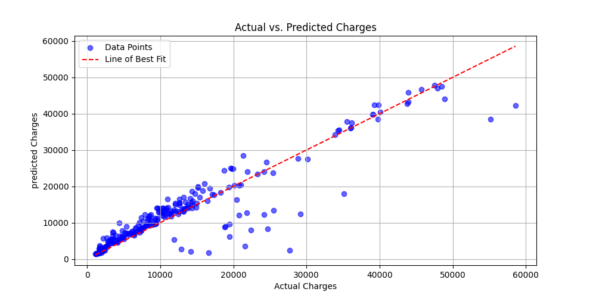

# Insurance Charges Analysis

This project analyzes the [`insurance.csv`](https://github.com/D2himself/Insurance-charges-analysis/blob/main/data/insurance.csv) dataset to develop a regression model for predicting insurance charges. The model's accuracy is evaluated using the R-Squared Score. Additionally, the model is applied to estimate `predicted_charges` for unseen data in [`validation_dataset.csv`](https://github.com/D2himself/Insurance-charges-analysis/blob/main/data/validation_dataset.csv).

## Project Structure

- **insurance.csv:** The primary dataset used for model traning and analysis.
- **validation_dataset.csv:** Dataset used for validating the trained model.
- [**results**](https://github.com/D2himself/Insurance-charges-analysis/tree/main/results): Directory containing generated visualization and outputs.
- **README.md:** This file, providing an overview of the project.

## Data Cleaning and Preprocessing

- Missing values are handled using the `dropna` function.
- Categorical variables such as 'sex' and 'smoker' are converted into numerical representations.
- Dummy varibles are created for the 'region' variables to handle categorical data in the regression model.
- The targer variable 'charges' is converted to numeric.

## Exploratory Data Analysis (EDA)

- Distribution of unsurance charged for smokers and non-smokers is visualied usinf histograms and box plots.
- The relationship between 'bmi' and 'charges' is explored using scatter plots, highlighting the impact of smoking.
- A correlation heatmap is generated to visualize relationships between numeric variables.

## Model Development

- A linear regression model is initially fit to the data, followed by a RandomForestRegressor.
- The RandomForestRegressor is optimized using GridSearchCV with various hyperparameters.
- The model's accuracy is assessed using the R-Squared score.

## Model Validation

- The trained model is used to predict charges for the validation dataset ('validation_dataset.csv').
- A Scatter plot compares the actual charges against the predicted charges for visual evaluation.
- Feature importance is extracted from the model to understand the unfluence of variables on predictions.
  [important features]((https://github.com/D2himself/Insurance-charges-analysis/blob/main/results/feature%20importance.png))
- The predictions for the validation set are added to a new column named 'predicted_charges'.

## Results
- **Distribution of Charges**:
  
  The histogram shows the distribution of insurance charges, revealing a skew toward higher charges.
  
- **Charges vs. BMI**:
  [Charges vs. BMI]((https://github.com/D2himself/Insurance-charges-analysis/blob/8afd528adfa52ba5dc1d157cc90fa0d1a7f93a02/results/insurance%20vs.%20bmi.png))
  A scatterplot showing the relationship between BMI and charges, with smokers having significantly higher charges.

- **Actual vs. Predicted Charges**:
  
  The scatter plot shows the relationship between the actual insurance charges and the predicted charges made by the model.
  Randon Forest achieved **85% accuracy** 

## Tools Used
- **Python:** pandas, scikit-learn, matplitlib, seaborn, plotly
